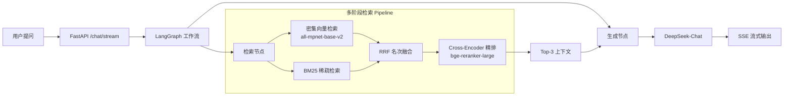

# Miemie-Agent-RAG

基于 **LangGraph + Milvus + DeepSeek** 的混合检索增强生成（RAG）系统。支持多路召回、RRF 融合与 Cross-Encoder 精排，面向高并发流式问答场景。

## 架构概览



## 核心特性

| 特性 | 说明 |
|---|---|
| **混合检索** | 密集向量（语义匹配）+ BM25（关键词匹配）双路并行召回 |
| **RRF 融合** | Reciprocal Rank Fusion 名次融合算法，合并两路结果 |
| **Cross-Encoder 精排** | BGE-Reranker-Large 对粗筛候选集做精确语义相关度打分 |
| **流式输出** | SSE（Server-Sent Events）协议，token 级实时推送 |
| **单例架构** | LLM 客户端与检索器全局复用，避免高并发下重复初始化 |
| **优雅降级** | LLM 调用失败时返回提示而非 500 错误 |
| **K8s 部署** | 支持水平扩容，3 副本 + NodePort 对外暴露 |

## 技术栈

| 层级 | 技术 |
|---|---|
| Web 框架 | FastAPI + Uvicorn |
| Agent 编排 | LangGraph (StateGraph) |
| 向量数据库 | Milvus Lite |
| 大语言模型 | DeepSeek-Chat |
| Embedding | sentence-transformers/all-mpnet-base-v2 (768d) |
| 稀疏检索 | BM25Okapi (rank-bm25) |
| 精排模型 | BAAI/bge-reranker-large |
| 压测 | Locust |
| 容器编排 | Docker + Kubernetes |

## 快速开始

### 环境要求

- Python 3.10+
- 8GB+ 内存（精排模型约 1.3GB）

### 1. 克隆项目

```bash
git clone https://github.com/miemie098/Miemie-Agent-RAG.git
cd Miemie-Agent-RAG
```

### 2. 配置环境变量

```bash
cp .env.example .env
# 编辑 .env，填入你的 DeepSeek API Key
```

### 3. 安装依赖

```bash
# 核心依赖
pip install -r requirements.txt

# 开发依赖（含测试/压测/评测）
pip install -r requirements-dev.txt
```

### 4. 下载精排模型

```bash
python download_models.py
```

### 5. 灌入知识库

将 PDF 文档放入 `data/` 目录，然后运行：

```bash
python ingest.py
```

### 6. 启动服务

```bash
python app/main.py
```

服务启动后访问：
- API 文档：http://localhost:8000/docs
- 流式问答：`POST http://localhost:8000/chat/stream`

### 7. 测试流式接口

```bash
python test_stream.py
```

### Docker 部署 (可选)

```bash
# 构建镜像
docker build -t miemie-rag-app .

# 启动容器 (通过 --env-file 注入 API Key)
docker run -p 8000:8000 --env-file .env miemie-rag-app
```

## API 文档

### POST /chat/stream

流式智能问答接口（SSE）。

**Request:**
```json
{
  "question": "什么是 PagedAttention？它如何解决 KV Cache 内存碎片问题？"
}
```

**Response (SSE):**
```
data: {"answer": "PagedAttention"}

data: {"answer": " 是 vLLM"}

data: {"answer": " 提出的..."}

data: [DONE]
```

## 项目结构

```
Miemie-Agent-RAG/
├── app/
│   ├── main.py                 # FastAPI 入口，SSE 流式路由
│   ├── graph/
│   │   ├── nodes.py            # LangGraph 节点：检索 + 生成
│   │   └── workflow.py         # 状态图构建，retrieve → generate
│   └── services/
│       └── retriever.py        # 混合检索核心：Dense+BM25+RRF+Rerank
├── data/                       # 知识库 PDF 文档
├── tests/
│   └── evaluate_report.py      # LLM-as-Judge 评测大盘
├── ingest.py                   # 文档解析与向量化入库
├── download_models.py          # 预下载精排模型
├── locustfile.py               # Locust 压测脚本
├── deployment.yaml             # K8s Deployment + Service
├── Dockerfile                  # 容器化构建
├── .env.example                # 环境变量模板
└── requirements.txt            # 项目依赖
```

## 评测

运行 LLM-as-Judge 评测：

```bash
python tests/evaluate_report.py
```

评测维度：
- 事实准确性
- 方案完备性
- 知识密度

输出 Bootstrap 95% 置信区间下的平均得分，以及 P50/P99 延迟。

## 压测

```bash
locust -f locustfile.py --host http://localhost:8000
```

## License

MIT
