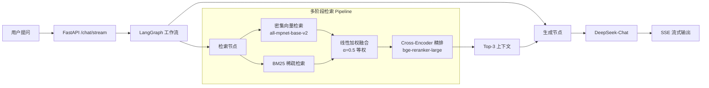

# Miemie-Agent-RAG

基于 **LangGraph + Milvus + DeepSeek** 的混合检索增强生成（RAG）系统。支持多路召回、线性加权融合与 Cross-Encoder 精排（ONNX Runtime + INT8 量化加速），面向高并发流式问答场景。内置会话管理（thread_id）与 LLM-as-Judge 评测框架。

## 架构概览



## 核心特性

| 特性 | 说明 |
|---|---|
| **混合检索** | 密集向量（语义匹配）+ BM25（关键词匹配）双路并行召回 |
| **融合策略** | 支持 RRF 与线性加权融合（α 可配）；实测 RRF 在该领域最优（7.69 vs α=0.5 的 6.73） |
| **Cross-Encoder 精排** | BGE-Reranker-Large，ONNX Runtime + INT8 动态量化加速（35s → 6.7s） |
| **流式输出** | SSE（Server-Sent Events）协议，token 级实时推送 |
| **会话管理** | thread_id + SqliteSaver checkpointer，服务端持久化多轮对话历史 |
| **滑动窗口** | 自动裁剪最近 5 轮历史送入 LLM，防止上下文溢出 |
| **单例架构** | LLM 客户端与检索器全局复用，避免高并发下重复初始化 |
| **优雅降级** | LLM 调用失败时返回提示而非 500 错误 |
| **评测框架** | LLM-as-Judge 自动打分（0-10），Bootstrap 95% CI，结果 JSON/Markdown 双格式输出 |
| **K8s 部署** | 支持水平扩容，3 副本 + NodePort 对外暴露 |

## 技术栈

| 层级 | 技术 |
|---|---|
| Web 框架 | FastAPI + Uvicorn |
| Agent 编排 | LangGraph (StateGraph) |
| 向量数据库 | Milvus Lite |
| 大语言模型 | DeepSeek-Chat |
| Embedding | sentence-transformers/all-mpnet-base-v2 (768d) |
| 稀疏检索 | BM25Okapi (rank-bm25) |
| 精排模型 | BAAI/bge-reranker-large（ONNX Runtime + INT8 量化） |
| 推理加速 | ONNX Runtime 1.23, INT8 动态量化 |
| 会话持久化 | SqliteSaver (LangGraph Checkpointer) |
| 压测 | Locust |
| 容器编排 | Docker + Kubernetes |

## 快速开始

### 环境要求

- Python 3.10+
- 8GB+ 内存（精排模型约 1.3GB）

### 1. 克隆项目

```bash
git clone https://github.com/miemie098/Miemie-Agent-RAG.git
cd Miemie-Agent-RAG
```

### 2. 配置环境变量

```bash
cp .env.example .env
# 编辑 .env，填入你的 DeepSeek API Key
```

### 3. 安装依赖

```bash
# 核心依赖
pip install -r requirements.txt

# 开发依赖（含测试/压测/评测）
pip install -r requirements-dev.txt
```

### 4. 下载精排模型

```bash
python download_models.py
```

### 5. 灌入知识库

将 PDF 文档放入 `data/` 目录，然后运行：

```bash
python ingest.py
```

### 6. 启动服务

```bash
python app/main.py
```

服务启动后访问：
- API 文档：http://localhost:8000/docs
- 流式问答：`POST http://localhost:8000/chat/stream`

### 7. 测试流式接口

```bash
python test_stream.py
```

### Docker 部署 (可选)

```bash
# 构建镜像
docker build -t miemie-rag-app .

# 启动容器 (通过 --env-file 注入 API Key)
docker run -p 8000:8000 --env-file .env miemie-rag-app
```

## API 文档

### POST /chat

非流式问答接口，返回完整答案。

**Request:**
```json
{
  "question": "什么是 PagedAttention？",
  "thread_id": null
}
```

**Response:**
```json
{
  "answer": "PagedAttention 是 vLLM 提出的一种...",
  "thread_id": "a1b2c3d4-e5f6-7890-abcd-ef1234567890"
}
```

> `thread_id` 可选：不传则自动生成；传入已有 ID 可恢复历史会话上下文。

### POST /chat/stream

流式智能问答接口（SSE）。同样支持 `thread_id`。

**Request:**
```json
{
  "question": "它和传统方案有什么区别？",
  "thread_id": "a1b2c3d4-e5f6-7890-abcd-ef1234567890",
  "messages": []
}
```

**Response (SSE):**
```
data: {"answer": "PagedAttention"}

data: {"answer": " 与传统方案"}

data: {"answer": " 的核心区别在于..."}

data: {"thread_id": "a1b2c3d4-e5f6-7890-abcd-ef1234567890"}

data: [DONE]
```

> 第二问携带第一问返回的 `thread_id`，服务端自动从 checkpoint 恢复上文，无需客户端维护完整 `messages` 列表。

## 项目结构

```
Miemie-Agent-RAG/
├── app/
│   ├── main.py                 # FastAPI 入口，SSE 流式路由
│   ├── graph/
│   │   ├── nodes.py            # LangGraph 节点：检索 + 生成
│   │   └── workflow.py         # 状态图构建，retrieve → generate
│   └── services/
│       └── retriever.py        # 混合检索核心：Dense+BM25+线性加权+Rerank
├── data/                       # 知识库 PDF 文档
├── tests/
│   ├── test_retriever.py       # 检索器与融合算法单元测试
│   ├── test_nodes.py           # LangGraph 节点单元测试
│   ├── test_workflow.py        # 工作流结构单元测试
│   ├── evaluate_report.py      # LLM-as-Judge 评测（支持融合对比）
│   └── results/                # 评测结果存档（JSON + Markdown）
├── ingest.py                   # 文档解析与向量化入库
├── download_models.py          # 预下载精排模型
├── probe_network.py            # DeepSeek API 连通性探针
├── test_stream.py              # 流式接口手动测试
├── locustfile.py               # Locust 压测脚本
├── pyproject.toml              # pytest 配置
├── deployment.yaml             # K8s Deployment + Service
├── Dockerfile                  # 容器化构建
├── .env.example                # 环境变量模板
└── requirements.txt            # 项目依赖
```

## 评测

### 默认评测

```bash
python tests/evaluate_report.py
```

### 融合策略对比评测

```bash
python tests/evaluate_report.py --compare
```

对 RRF、Linear Weighted (α=0.3/0.5/0.7) 四种配置分别评测，输出逐样本得分对比、Bootstrap 95% CI、延迟统计及综合排名。

评测结果自动保存到 `tests/results/`，同时输出 JSON 和 Markdown 两种格式。

### 融合策略对比结论（2026-07-22，n=9）

| 排名 | 策略 | 平均得分 | P50 延迟 |
|---|---|---|---|
| 👑 #1 | **RRF (k=60)** | **7.69** | 38.5s |
| #2 | Linear α=0.3 (BM25 偏重) | 7.46 | 36.2s |
| #3 | Linear α=0.7 (Dense 偏重) | 7.32 | 34.1s |
| #4 | Linear α=0.5 (等权) | 6.73 | 34.8s |

> RRF 在该 AI Infra 领域表现最优，因其对分数尺度不敏感，避免了线性加权中某一侧分数碾压另一侧的问题。

### Cross-Encoder 重排推理优化

BGE-Reranker-Large（560M 参数）在 CPU 上的推理加速历程：

| 阶段 | 方案 | max_length | 单次 rerank | 累计提速 |
|---|---|---|---|---|
| 原始 | PyTorch eager | 512 | ~35,000ms | 1× |
| 1 | max_length 256 | 256 | ~17,000ms | 2.1× |
| 2 | ONNX Runtime FP32 | 256 | ~18,000ms | 1.9× |
| **3** | **ONNX Runtime + INT8 量化** | 256 | **~6,700ms** | **5.2×** |

> 端到端延迟从 ~40s 降至 ~12s。如需毫秒级响应，建议使用 GPU 或换 bge-reranker-base（110M）。

## 压测

```bash
locust -f locustfile.py --host http://localhost:8000
```

## License

MIT
